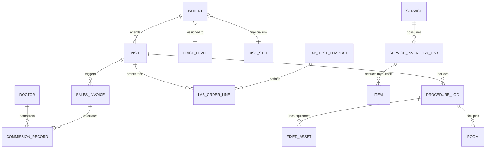

# Technical Specification: Clinic System Enhancement

Legacy AssetMS features are deprecated; clinic workflows now reference the financial module for equipment metadata and the inventory module for consumable deductions.

## 1. Phase 1: Database Schema & Entity Hardening

### A. Modifications to Existing Tables

#### Table: `Patient`
| Column | Type | Purpose |
| :--- | :--- | :--- |
| `DateOfBirth` | DateTime | Replaces age for accuracy. |
| `PriceLevelId` | int (FK) | Links to `PriceLevel` for automated billing rates. |
| `MemberClassId` | int (FK) | Categorizes patient (Gold, Silver, etc.). |
| `RiskStepId` | int (FK) | Defines credit risk/approval level. |
| `Allergies` | string | CSV or JSON list of known medical allergies. |

#### Table: `Doctor`
| Column | Type | Purpose |
| :--- | :--- | :--- |
| `CommissionRate`| decimal | Percentage (e.g., 0.10 for 10%) per service. |
| `LicenseNo` | string | Professional medical registration number. |

---

### B. New Core Entities

#### Table: `ServiceInventoryLink`
*Purpose: Automates stock deduction when a clinical service is performed.*
- `Id` (int PK)
- `ServiceId` (int FK)
- `InventoryItemId` (int FK)
- `QuantityRequired` (decimal)

#### Table: `ProcedureLog`
*Purpose: Tracks usage of high-value equipment and rooms.*
- `Id` (int PK)
- `VisitId` (int FK)
- `FixedAssetId` (int FK) -> Link to the financial module’s **FixedAsset** register (e.g., Laser Machine).
- `StartTime` (DateTime)
- `EndTime` (DateTime)

#### Table: `LabTestTemplate`
*Purpose: Master configuration for lab tests.*
- `Id` (int PK)
- `TestName` (string)
- `Category` (string) -> e.g., Blood, Skin, Urine.
- `NormalRangeMin` (decimal)
- `NormalRangeMax` (decimal)
- `Unit` (string) -> e.g., mg/dL, g/L.
- `ExpectedResult` (string) -> For qualitative tests (e.g., "Negative").

#### Table: `ClinicalProtocol`
*Purpose: Standard medical steps for a procedure.*
- `Id` (int PK)
- `ProtocolName` (string)
- `ServiceId` (int FK)

#### Table: `ProtocolStep`
- `Id` (int PK)
- `ProtocolId` (int FK)
- `StepOrder` (int)
- `Description` (string)

#### Table: `LabOrderLine`
*Purpose: Stores the actual patient results for a specific visit.*
- `Id` (int PK)
- `VisitId` (int FK)
- `TemplateId` (int FK) -> Link to `LabTestTemplate`.
- `ActualValue` (decimal)
- `ActualResult` (string)
- `IsAbnormal` (bool) -> **System-Calculated**.

#### Table: `VisitMedication` (Scan-Based)
*Purpose: Recorded only when a physical item is scanned by the pharmacist.*
- `Id` (int PK)
- `VisitId` (int FK)
- `ItemId` (int FK) -> Linked directly via QR/Barcode scan.
- `Quantity` (decimal)
- `UnitPriceAtTimeOfScan` (decimal) -> For accurate billing.

---

## 2. Phase 2: Service Layer Specifications

### Interface: `IClinicService`
| Method | Purpose | Input | Output |
| :--- | :--- | :--- | :--- |
| `CreateEstimateAsync` | Generates a quote. | `EstimateRequest` | `EstimateResponse` |
| `ConvertToInvoiceAsync`| Converts quote to bill. | `int estimateId` | `InvoiceDto` |
| `PerformServiceAsync` | Deducts stock & logs assets. | `ServiceExecRequest`| `ExecutionResult` |
| `ProcessLabResultAsync`| Validates actual vs normal. | `ResultInput` | `LabResultDto` |

**Method Logic: `ProcessLabResultAsync`**
1. Fetch the `LabTestTemplate` linked to the order.
2. If `ActualValue` is provided, compare it against `NormalRangeMin` and `NormalRangeMax`.
3. Set `IsAbnormal = true` if value is out of range.
4. Update `LabOrderLine` and trigger a notification if `IsAbnormal` is true.

## Integration Contracts & Events
- **`Clinic.VisitCompleted`** → emitted when discharge succeeds; payload contains visit totals, invoiceId, and outstanding AR balance for the financial module.
- **`Clinic.ProcedureLogged`** → raised whenever `ProcedureLog` inserts, forwarding `FixedAssetId`, `VisitId`, and usage duration so finance can calculate utilization KPIs.
- **`Clinic.ServiceInventoryRequest`** → synchronous call to Inventory `ServiceInventoryLink` to reserve kits and emit `Inventory.KitConsumed` upon completion.
- **`Clinic.LabOrderCreated` / `Clinic.LabResultPosted`** → events that allow external LIS systems or analytics engines to subscribe without touching core tables.

---

## 3. Phase 3: Data Entry & Automation Logic

### User vs. System Responsibilities

| Workflow | **User Entry** (Manual) | **System Entry** (Automatic) |
| :--- | :--- | :--- |
| **Services (Hair Transplant)** | Select "Hair Transplant" & Doctor. | Calculate Price, Tax, & Doctor Commission. |
| **Lab Ordering** | Select Lab Test Template(s). | Populate Normal Ranges & Units on the order. |
| **Lab Results** | Enter "Actual Value" from the lab. | Calculate "IsAbnormal" flag and link to Finance. |
| **Inventory** | (None) | Deduct needles/swabs based on `ServiceInventoryLink`. |

---

## 3. Phase 3: API Specifications (Hybrid Workflow)

Instead of a single monolithic form, the system uses a **Step-by-Step Hybrid Approach**. Data is saved as it occurs in each department.

### A. Endpoint: `POST /api/Clinic/Estimate/Create`
**Purpose**: Generates a non-binding price quote for a patient.

**Exact Payload**:
```json
{
  "patientId": 101,
  "serviceIds": [5, 12],
  "discountPercentage": 5,
  "notes": "Valid for 30 days"
}
```

### B. Clinical Intake & Orders (Doctor/Nurse)
**Endpoint**: `PATCH /api/Clinic/Visit/{id}/Clinical`
**Purpose**: Saves clinical findings and issues "Orders" to Pharmacy/Lab.

```json
{
  "vitals": { "bp": "120/80", "temp": 37.2 },
  "notes": "Patient requires hair transplant",
  "prescriptions": [
    { "itemId": 44, "dosage": "1x daily" }
  ],
  "labOrders": [
    { "templateId": 10 }
  ]
}
```

### C. Procedure & Resource Logging (Operation Center)
**Endpoint**: `POST /api/Clinic/Visit/{id}/Resources`
**Purpose**: Records physical assets and kits used.

```json
{
  "procedures": [
    {
      "serviceId": 5, 
      "fixedAssetId": 102, 
      "roomId": 1 
    }
  ],
  "kitsUsed": [
    { "kitId": 3 }
  ]
}
```

### D. Final Visit Completion (Reception/Discharge)
**Endpoint**: `POST /api/Clinic/Visit/{id}/Complete`
**Purpose**: Finalizes the visit, checks for unfulfilled orders, and triggers Financial Journal Entries.

**Exact Response**:
```json
{
  "invoiceId": "INV-2026-088",
  "totalDue": 12500.00,
  "arBalance": 12500.00,
  "accountingStatus": "Posted"
}
```

---

## 4. Phase 4: Operational Implementation Steps

1.  **Migration**: Run SQL scripts to add `PriceLevelId` and `RiskStepId` to the `Patient` table.
2.  **Configuration**: Define standard `ServiceInventoryLink` for the top 20 services (e.g., 1 Laser Session = 50ml Laser Gel).
3.  **UI Update**: Update the Reception screen to show a "Warning" if a patient's `RiskStep` is "High Risk."
4.  **Accounting Hook**: Subscribe to `VisitCompleted` event to auto-generate a `JournalEntry` in the Financial module.

---

## 5. Comprehensive Clinical ERD



## UI/UX & Deployment Strategy
- Rebuild the visit intake, clinical note, and discharge forms as needed; since the platform is rolling out fresh, discard legacy UI debt.
- Align shared components (estimate builders, service selection, lab ordering) with Inventory/Sales so users see consistent controls.
- No historical migration is required; populate demo/pilot data via automated scripts only.

## Testing Strategy
### Unit Tests
- Validation for patient risk flags, allergy recording, and commission calculations
- ServiceInventoryLink automation (kit matching, deduction) and lab result abnormality logic
- ProcedureLog duration calculations tied to financial asset references

### Integration & Contract Tests
- `Clinic.VisitCompleted`, `Clinic.ProcedureLogged`, and financial AR contract tests
- Inventory reservation + deduction flows, ensuring `Clinic.ServiceInventoryRequest` completes idempotently
- External LIS integrations for `Clinic.LabOrderCreated` / `Clinic.LabResultPosted`

### UI/UX Validation
- Scenario-based Cypress/Playwright flows for intake → treatment → discharge
- Accessibility/localization checks across rebuilt forms (en, ps-AF, fa-IR)
- Usability walkthroughs with reception, nursing, and finance stakeholders to confirm redesigned steps
