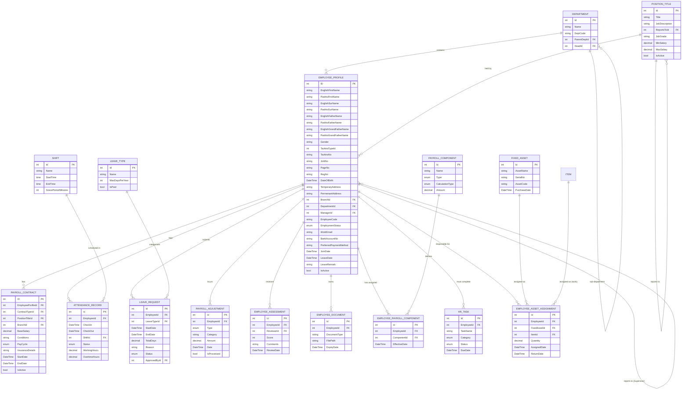

# Comprehensive HR System Enhancement Plan

## Executive Summary

This document outlines a comprehensive plan to enhance the Crystal Clinic HR system from basic employee and payroll tracking to a full-featured, standard HR management system.

Legacy AssetMS functionality is retired; HR references the financial module’s fixed-asset register for asset metadata and only manages assignment counts per employee.

## Current State Assessment (Dec 2025)

The current HR system is a **basic administrative database** (readiness: ~28%). It handles basic personal data and simple contract records but lacks the structural depth and automation required for enterprise resource management.

---

## Phased Implementation Roadmap

### Overview: Three Phases Over 16+ Weeks
This plan is structured to deliver value incrementally while ensuring critical functionality (payroll, leave, compliance) is correct from day one.

### Phase 1: MVP Foundation (Weeks 1-6) — Deploy Immediately
**Goal**: Operational HR system with core data management and basic payroll

#### Deliverables
1. **Database Schema**
   - EmployeeProfile (with DepartmentId, ManagerId, BankAccountNo, EmploymentStatus)
   - PayrollContract (replaces ContractDetails with BaseSalary, PayCycle, Conditions)
   - AttendanceRecord (check-in/out, shift linking)
   - LeaveRequest & LeaveType tables
   - PayrollComponent & EmployeePayrollComponent (for benefits/deductions)
   - Basic lookup tables (Department, PositionTitle, Shift, LeaveType)

2. **Core Services**
   - `IAttendanceService`: Log attendance, calculate working hours
   - `ILeaveService`: Submit leave requests, balance tracking (**critical**)
   - `IPayrollService`: Generate payroll with base salary + fixed deductions (**critical**)
   - Basic employee CRUD operations

3. **APIs (REST Endpoints)**
   - Employee management: POST/PUT/GET/DELETE `/api/HR/Employees`
   - Contracts: POST/PUT/GET `/api/HR/Contracts`
   - Attendance: POST `/api/HR/Attendance/CheckIn`, POST `/api/HR/Attendance/CheckOut`, GET `/api/HR/Attendance`
   - Leave: POST `/api/HR/Leave/Request`, GET `/api/HR/Leave/Balance`, GET `/api/HR/Leave/Requests`
   - Payroll: POST `/api/HR/Payroll/Generate` (basic), GET `/api/HR/Payroll/History`

4. **Financial Integration (Phase 1 Scope)**
   - Map payroll to GL accounts:
     - `Debit: Salary Expense (5101)` | `Credit: Payable to Employee (2102)`
     - `Debit: Payable to Employee (2102)` | `Credit: Cash/Bank (1101)`
   - Emit `HR.PayrollGenerated` event with period totals (no details yet)
   - Journal entries created in **Draft** status, reviewed before posting

5. **UI Components**
   - Employee profile form (basic personal info, bank account, department, manager)
   - Contract assignment screen
   - Simple attendance check-in/out (can be manual or barcode-based)
   - Leave request submission and balance display
   - Basic payroll generation button with summary preview

6. **Testing**
   - Unit tests for leave balance calculations (accrual, deductions, carryover)
   - Unit tests for payroll GL mappings and journal entry generation
   - Integration tests for attendance → payroll flow
   - Contract tests for `HR.PayrollGenerated` event payload

#### Critical Implementation Requirements (Non-Negotiable)

##### A. Leave Balance Accuracy
**Why**: Employees check their balance weekly; errors damage trust and create disputes.

```csharp
public class LeaveBalanceService
{
    public async Task<LeaveBalance> GetBalance(int employeeId, int leaveTypeId)
    {
        var leaveType = await _context.LeaveTypes.FindAsync(leaveTypeId);
        var startOfYear = new DateTime(DateTime.Now.Year, 1, 1);
        
        // Annual entitlement
        var entitlement = leaveType.MaxDaysPerYear;
        
        // Used leaves (including pending approvals)
        var used = await _context.LeaveRequests
            .Where(r => r.EmployeeId == employeeId 
                && r.LeaveTypeId == leaveTypeId
                && r.StartDate >= startOfYear
                && (r.Status == LeaveStatus.Approved || r.Status == LeaveStatus.Pending))
            .SumAsync(r => r.TotalDays);
        
        // Carryover (if policy allows)
        var carryover = await _context.LeaveCarryovers
            .Where(c => c.EmployeeId == employeeId && c.LeaveTypeId == leaveTypeId)
            .SumAsync(c => c.RemainingDays);
        
        return new LeaveBalance
        {
            AvailableDays = (entitlement + carryover) - used,
            UsedDays = used,
            EntitlementDays = entitlement,
            CarryoverDays = carryover,
            AsOfDate = DateTime.UtcNow
        };
    }
}
```

**Validation Rules** (implement as FluentValidation):
- Leave request dates must be in future or same day
- Cannot request more days than available balance
- Weekends/public holidays excluded from calculation
- Conflicting leave requests rejected
- Sick leave requests may not exceed 3 consecutive days without medical cert

##### B. Payroll GL Mapping (Immutable from Day 1)
**Why**: Finance reconciliation depends on consistent accounts; changing GL accounts mid-year breaks reports.

```csharp
public class PayrollGLMapping
{
    public const int SALARY_EXPENSE_ACCOUNT = 5101;      // Salaries & Wages
    public const int EMPLOYEE_PAYABLE_ACCOUNT = 2102;    // Accrued Payroll Payable
    public const int CASH_ACCOUNT = 1101;                 // Cash/Bank
    public const int TAX_PAYABLE_ACCOUNT = 2103;          // Income Tax Payable
    public const int BENEFIT_EXPENSE_ACCOUNT = 5110;      // Benefits Expense
}

public class PayrollJournalGenerator
{
    public async Task<JournalEntry> GeneratePayrollEntry(PayrollRecord payroll)
    {
        var entry = new JournalEntry
        {
            EntryDate = payroll.PayrollDate,
            Description = $"Payroll {payroll.Period}",
            Status = JournalEntryStatus.Draft // ← CRITICAL: Draft until reviewed
        };

        // Line 1: Expense
        entry.AddLine(new JournalEntryLine
        {
            ChartOfAccountId = PayrollGLMapping.SALARY_EXPENSE_ACCOUNT,
            DebitAmount = payroll.BaseSalary + payroll.Bonuses,
            Description = $"Salary for {payroll.Period}"
        });

        // Line 2: Accrual (credit side)
        entry.AddLine(new JournalEntryLine
        {
            ChartOfAccountId = PayrollGLMapping.EMPLOYEE_PAYABLE_ACCOUNT,
            CreditAmount = payroll.BaseSalary + payroll.Bonuses - payroll.Deductions,
            Description = $"Payable to employees"
        });

        // Validate double-entry
        if (entry.TotalDebits != entry.TotalCredits)
            throw new ValidationException("Journal entry does not balance");

        return entry;
    }
}
```

**Configuration** (seed on startup):
```json
{
  "PayrollGLAccounts": {
    "SalaryExpense": 5101,
    "BonusExpense": 5102,
    "EmployeePayable": 2102,
    "TaxPayable": 2103,
    "BenefitExpense": 5110,
    "AdvanceAccount": 2104
  }
}
```

##### C. Tax Deduction Accuracy (Legal Compliance)
**Why**: Withholding tax is a legal obligation; errors create liability.

```csharp
public class TaxCalculationService
{
    public decimal CalculateIncomeTax(decimal baseSalary, int employeeId)
    {
        // Placeholder: Configure per country/region
        // Afghanistan: Progressive tax brackets
        // Example: 0-50,000 AFN @ 0%, 50,001-100,000 @ 10%, 100,001+ @ 20%
        
        if (baseSalary <= 50000) return 0;
        if (baseSalary <= 100000) return (baseSalary - 50000) * 0.10m;
        return (50000 * 0.10m) + ((baseSalary - 100000) * 0.20m);
    }

    public decimal CalculateSocialInsurance(decimal baseSalary)
    {
        // Typically 5-10% of gross salary
        return baseSalary * 0.08m;
    }
}
```

**Validation**:
- Tax calculation must be auditable (store formula + rate version used)
- Social insurance contributions verified against government rates
- Monthly tax reports reconcile to GL postings

#### Phase 1 Implementation Timeline

| Week | Task | Deliverable |
| :--- | :--- | :--- |
| 1 | Database design & EF Core migrations | Schema created, migrations tested |
| 1-2 | Core entities (Employee, Contract, Attendance, Leave) | 4 entities with audit fields |
| 2-3 | Service layer (Attendance, Leave, basic Payroll) | 3 services with unit tests |
| 3-4 | API endpoints for CRUD + Leave/Payroll | 6 endpoints documented in Swagger |
| 4 | GL mapping configuration + Journal generation | Payroll → Draft JE (no posting yet) |
| 4-5 | UI forms (Employee, Contract, Attendance, Leave) | 4 pages, responsive design |
| 5 | Integration testing (end-to-end workflows) | E2E tests pass, leave balance correct, payroll GL verified |
| 6 | Deployment prep + documentation | Deploy to staging, UAT with HR team |

---

### Phase 2: Enhanced Business Logic (Weeks 7-12)
**Goal**: Add advanced payroll, leave approval workflows, and attendance rules

#### Additional Deliverables
1. **Payroll Enhancements**
   - Benefits and deductions components (PayrollComponent, EmployeePayrollComponent)
   - Variable pay: bonuses, allowances, penalties
   - Multi-component payroll calculation engine
   - Overtime processing with premium rates
   - GL mapping for each component type
   - Payroll approval workflow before posting

2. **Leave Management**
   - Leave approval hierarchy (manager → HR → Finance)
   - Leave accrual schedules (annual entitlement, carryover rules)
   - Different leave types with distinct rules (annual, sick, maternity, emergency)
   - Leave balance reports and forecasts

3. **Attendance Rules**
   - Grace period enforcement (e.g., 5 mins before marking late)
   - Late deduction calculation and GL posting
   - Overtime approval and compensation
   - Shift flexibility and swap requests

4. **Events & Integrations**
   - `HR.PayrollGenerated` with full component details
   - `HR.PayrollPaid` with payment references for AP reconciliation
   - `HR.LeaveStatusChanged` (approved/rejected) notifies Clinic scheduling
   - Subscribe to Finance `JournalEntry.Posted` to mark payroll as finalized

5. **Advanced APIs**
   - POST `/api/HR/Payroll/{id}/Approve` (multi-level approval)
   - POST `/api/HR/Payroll/{id}/Post` (move from Draft → Posted)
   - GET `/api/HR/Leave/Reports/Accrual` (balance forecast)
   - POST `/api/HR/Leave/{id}/Approve`, `/Reject`
   - GET `/api/HR/Attendance/Reports/Overtime`

---

### Phase 3: Advanced Features (Weeks 13-16+)
**Goal**: Performance management, asset tracking, and advanced analytics

#### Deliverables
1. **Performance & Assessment**
   - Employee assessments with scoring
   - 360-degree review workflows
   - Performance-based pay adjustments

2. **Asset Management**
   - Employee asset assignments (links to financial module FixedAsset)
   - Equipment handover on onboarding/offboarding
   - Asset return tracking

3. **Onboarding & Offboarding**
   - HRTask workflows with checklists
   - Equipment provisioning automation
   - Exit interviews and documentation

4. **Advanced Analytics**
   - Headcount planning and forecasting
   - Turnover analysis
   - Salary competitiveness reports
   - HR dashboards with KPIs

---

## Technical Implementation Details

### 1. Database Schema Changes (Entity Level)

#### Table: `EmployeeProfile` (Modified)
| Field Name | Change | Purpose |
| :--- | :--- | :--- |
| `DepartmentId` | Add (int FK) | Links employee to a specific functional unit. |
| `ManagerId` | Add (int FK) | Self-referencing link for direct reporting hierarchy (**Supervisor**). |
| `EmploymentStatus`| Add (enum) | Tracks active, probation, leave, and termination states (**Type**). |
| `BankAccountNo` | Add (string) | Required for automated payroll transfers. |

#### Table: `PositionTitle` (Modified - HRLooks)
| Field Name | Change | Purpose |
| :--- | :--- | :--- |
| `ReportsToId` | Add (int FK) | Defines the reporting line for the position itself (**Job Titles**). |
| `JobGrade` | Add (string) | Links position to a **Salary Category**. |

#### Table: `PayrollContract` (**Evolution of existing `ContractDetails`**)
*Note: This table replaces `ContractDetails`, but production data currently lives only in `EmployeeProfile`, so treat the rename as a schema swap with fresh seed data rather than a legacy migration.*
| Field Name | Change | Purpose |
| :--- | :--- | :--- |
| `SalaryAmount` | Rename to `BaseSalary` | Fixed monthly salary (**Salary Details**). |
| `Conditions` | Add (string) | **Contract Conditions** (e.g., notice period, bonuses). |
| `PayCycle` | Add (enum) | Monthly, Bi-weekly, Hourly. |
| `InsuranceDetails`| Add (string) | Deductions for health or social insurance. |

#### New Table: `AttendanceRecord` (**Attendance Sheet**)
| Field Name | Type | Purpose |
| :--- | :--- | :--- |
| `EmployeeId` | int (FK) | Link to employee. |
| `CheckIn` / `CheckOut`| DateTime | Actual times. |
| `ShiftId` | int (FK) | Link to assigned **Shift**. |
| `Status` | enum | Present, Absent, Late, **Overtime**. |

#### New Table: `PayrollAdjustment` (**Charges Category / Rewards**)
| Field Name | Type | Purpose |
| :--- | :--- | :--- |
| `Type` | enum | Reward, Charge, **Overtime**. |
| `Category` | string | **Charges Category** (e.g., Penalty) or **Employee Rewards**. |
| `Amount` | decimal | **Charges Price** or Reward Value. |

#### New Table: `EmployeeAssessment`
| Field Name | Type | Purpose |
| :--- | :--- | :--- |
| `EmployeeId` | int (FK) | Link to employee. |
| `Score` | int | Performance rating. |

#### New Table: `PayrollComponent` (**Benefits & Deductions**)
| Field Name | Type | Purpose |
| :--- | :--- | :--- |
| `Name` | string | e.g., "Housing Allowance", "Income Tax", "Pension". |
| `Type` | enum | **Benefit** (Add to salary) or **Deduction** (Subtract). |
| `CalculationType` | enum | Fixed Amount or Percentage of Base Salary. |
| `Amount` | decimal | The value or percentage. |

#### New Table: `EmployeePayrollComponent`
| Field Name | Type | Purpose |
| :--- | :--- | :--- |
| `EmployeeId` | int (FK) | Link to employee. |
| `ComponentId` | int (FK) | Link to the benefit/deduction type. |
| `EffectiveDate` | DateTime | When this starts applying. |

#### Asset Tracking Source of Truth
- No new `FixedAsset` table is created inside HR; instead, `FixedAssetId` references the financial module’s fixed-asset register.
- Consumable assignments (e.g., uniforms) continue to reference Inventory `ItemId` when needed.

#### New Table: `EmployeeAssetAssignment`
| Field Name | Type | Purpose |
| :--- | :--- | :--- |
| `EmployeeId` | int (FK) | Who has the asset. |
| `FixedAssetId` | int (FK) | Link to financial module `FixedAsset`. |
| `ItemId` | int (FK, nullable) | Optional link to Inventory `Item` for consumables. |
| `Quantity` | decimal | How many units (supports "Employee A has 1 chair"). |
| `AssignedDate` | DateTime | When it was given to the employee. |
| `ReturnDate` | DateTime | When it was returned (null if still with employee). |

#### New Table: `SalaryGrade` (**Templates**)
| Field Name | Type | Purpose |
| :--- | :--- | :--- |
| `GradeName` | string | e.g., "Senior Doctor", "Junior Nurse". |
| `MinBaseSalary` | decimal | Lower bound for the grade. |
| `MaxBaseSalary` | decimal | Upper bound for the grade. |

#### New Table: `HRTask` (**Onboarding & Offboarding**)
| Field Name | Type | Purpose |
| :--- | :--- | :--- |
| `EmployeeId` | int (FK) | Employee the task is for. |
| `TaskName` | string | e.g., "Handover Laptop", "Sign ID Card", "Exit Interview". |
| `Category` | enum | **Onboarding** or **Offboarding**. |
| `Status` | enum | Pending, Completed, Cancelled. |
| `DueDate` | DateTime | Deadline for the task. |

---

### 2. Service Layer Specifications

#### `IAttendanceService`
- **`ProcessOvertimeRequestAsync(OvertimeRequest request)`**
  - **Input**: `employeeId`, `hours`, `type` (**Overtime Type**).
  - **Purpose**: Validates and approves **Overtime Requests**.

#### `IPayrollService` (**Pay Salaries**)
- **`GeneratePayrollAsync(int month, int year)`**
  - **Input**: Month, Year.
  - **Purpose**: Calculates salary + rewards - charges (**Payroll**). Automatically generates Financial Journal Entries.

### Integration Contracts & Events
- **`HR.PayrollGenerated`** → published after `GeneratePayrollAsync`, carrying period totals, so the financial module can prepare journal entry drafts.
- **`HR.PayrollPaid`** → emitted after salary disbursement; payload contains payment references for Accounts Payable reconciliation.
- **`HR.LeaveStatusChanged`** → notifies Clinic and Scheduling modules when approval decisions change availability.
- **`HR.AssetAssignmentChanged`** → event with `EmployeeId`, `FixedAssetId`, `Quantity` so finance and inventory dashboards stay in sync.

---

### 3. API Payload & Response Definitions

#### `POST /api/HR/Leave/Request` (Submit Leave)
- **Payload**:
```json
{
  "leaveTypeId": 1,
  "startDate": "2026-01-10T08:00:00Z",
  "endDate": "2026-01-15T17:00:00Z",
  "reason": "Family vacation"
}
```

---

### 4. Checklist Coverage Confirmation

The following items from your list are now explicitly covered:
- ✅ **Employees** & **Supervisor**: Via `EmployeeProfile` hierarchy.
- ✅ **Job Titles**: Via Enhanced `PositionTitle`.
- ✅ **Attendance Sheet**, **Shift**, **Overtime**: Via `AttendanceRecord`.
- ✅ **Salary Details**, **Payroll**, **Pay Salaries**: Via `PayrollContract` and `IPayrollService`.
- ✅ **Charges Category**, **Charges Price**, **Rewards**: Via `PayrollAdjustment`.
- ✅ **Leave**, **Employee Leaves**: Via `LeaveRequest` system.
- ✅ **Assessment**: Via `EmployeeAssessment`.
- ✅ **Benefits & Deductions**: Via `PayrollComponent` and `EmployeePayrollComponent`.
- ✅ **Onboarding/Offboarding**: Via `HRTask`.
- ✅ **Asset Tracking**: Via `EmployeeAssetAssignment` and `FixedAsset`.
- ✅ **Contract Conditions**: Via `PayrollContract`.
- ✅ **Transformation**: `ContractDetails` evolved into `PayrollContract`.

---

## 5. HR System ERD (Enhanced)



## UI/UX & Deployment Strategy
- Rebuild or simplify employee, payroll, leave, and asset assignment forms as needed; no retrofits are required because the rollout is greenfield.
- Keep shared widgets (employee pickers, benefit tables) aligned with Clinic and Finance UI guidelines.
- No data migration is needed—seed demo departments, positions, and payroll components automatically.

## Testing Strategy
### Unit Tests
- Validation for employment status transitions, payroll component calculations, and leave accrual rules
- PayrollAdjustment math (rewards, deductions, overtime) and asset assignment quantity enforcement
- Attendance and overtime calculations per shift definition

### Integration & Contract Tests
- `HR.PayrollGenerated`, `HR.PayrollPaid`, `HR.LeaveStatusChanged`, and `HR.AssetAssignmentChanged` contract suites
- Financial journal generation handshake tests for payroll events
- Clinic scheduling sync tests reacting to leave approvals/denials

### UI/UX Validation
- End-to-end UI tests for onboarding → payroll → offboarding scenarios
- Accessibility/localization coverage for HR forms
- Stakeholder usability sessions (HR ops, finance, line managers) to validate redesigned workflows
