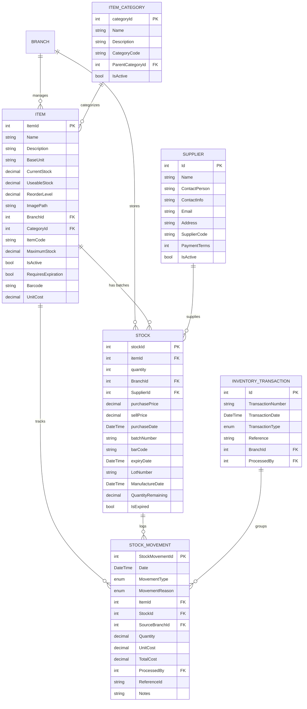

# Inventory System Enhancement Plan

## Executive Summary

This plan transforms the current financial asset management system into a comprehensive inventory management platform suitable for clinic operations. It adds physical inventory tracking for medications, medical supplies, and equipment while maintaining financial integration for cost accounting.

Legacy AssetMS functionality (asset depreciation, valuation) now resides inside the financial module; this inventory plan focuses on consumables, kits, and operational deductions, emitting events back to finance for valuation.

## Current State Assessment (Dec 2025)

The current inventory system is a **basic functional foundation** (readiness: ~23%) that allows for simple quantity tracking but lacks the auditability and financial depth required for a professional medical facility.

---

## Technical Implementation Details

### 1. Database Schema Changes (Entity Level)

#### Table: `Item` (Existing)
| Field Name | Change | Purpose |
| :--- | :--- | :--- |
| `ItemCode` | Add (string) | Unique identifier for SKU/Stock management. |
| `Barcode` | Add (string) | Supports scanner integration for faster operations. |
| `RequiresExpiration` | Add (bool) | Toggles mandatory expiry date logic for medications. |
| `UnitCost` | Add (decimal) | Stores the **Moving Average Cost (MAC)** for financial valuation. |
| `IsActive` | Add (bool) | Soft-disable items no longer used. |

#### Table: `Stock` (Existing)
| Field Name | Change | Purpose |
| :--- | :--- | :--- |
| `LotNumber` | Add (string) | Mandatory for medical batch tracking and recalls. |
| `ManufactureDate` | Add (DateTime) | Essential for shelf-life analysis. |
| `IsExpired` | Add (bool) | Indexed flag for fast filtering of unusable stock. |
| `QuantityRemaining` | Add (decimal) | Tracks usable stock separately from total quantity. |

#### Table: `StockMovement` (Modified)
| Field Name | Change | Purpose |
| :--- | :--- | :--- |
| `StockId` | Add (int FK) | Links the movement to a specific batch/lot. |
| `ProcessedBy` | Add (Guid FK) | Links movement to the user who performed it. |
| `UnitCost` | Add (decimal) | Records the value of the item at the exact moment of movement. |
| `TotalCost` | Add (decimal) | UnitCost * Quantity (Audit record). |

#### Table: `InventoryKit`
*Purpose: A template for a group of items used together (e.g., "Surgery Kit").*
- `Id` (int PK)
- `KitName` (string)
- `IsFreeForPatient` (bool) -> If true, the cost is internal expense.

#### Table: `InventoryKitLine`
- `Id` (int PK)
- `KitId` (int FK)
- `ItemId` (int FK)
- `Quantity` (decimal)

---

### 2. Service Layer Specifications

#### `IInventoryService`
The central brain for all stock changes.
- **`RegisterMovementAsync(MovementRequest request)`**
  - **Input**: `itemId`, `quantity`, `type` (In/Out/Adjust), `reason`, `sourceBatchId` (optional).
  - **Output**: `MovementResult` (Success/Fail, NewBalance).
  - **Purpose**: Replaces all direct quantity updates. Atomically updates `Stock.quantity` and inserts into `StockMovement`.

#### Integration Contracts & Events
- **Event Names**: `Inventory.StockAdjusted`, `Inventory.KitConsumed`, `Inventory.StockExpired`, each carrying `itemId`, `stockId`, `quantity`, `unitCost`, and `valuationMethod` to feed the financial module’s `FinancialBridge`.
- **Financial Hooks**: Every movement publishes to `IValuationService` for moving-average recalculation and to the Sales/Procurement module for PO receipt reconciliation.
- **Clinic Hooks**: `ServiceInventoryLink` consumers raise `Inventory.KitConsumed` so Clinic discharges can reconcile with actual stock deductions.

#### Reservation & Idempotency Contract
- **`Clinic.ServiceInventoryRequest` (Sync API)**
  - **Payload**: `{ "visitId": 501, "serviceId": 12, "items": [{ "itemId": 88, "quantity": 2 }], "idempotencyToken": "VIS-501-SVC-12", "ttlSeconds": 120 }`
  - **Semantics**: Inventory reserves batches for `ttlSeconds` and returns `{ status: "Reserved", reservationId, expiresAt, reservedLots[] }`. If the same `idempotencyToken` replays, the existing reservation is returned so retries never double-deduct.
  - **Completion**: Clinic calls `POST /api/Inventory/Reservation/{reservationId}/Commit` (or `.../Release`) once the procedure succeeds/fails. Background sweeper auto-releases expired reservations to avoid leakage.
  - **Failure Handling**: Network or downstream failures force Clinic to retry with the same token; Inventory responds deterministically. When Inventory cannot honor a request, it returns `409` with shortage details so Clinic can prompt substitution before proceeding.

---

### 3. API Payload & Response Definitions

#### `POST /api/Inventory/StockTake` (Manual Adjustment)
- **Payload**:
```json
{
  "stockId": 105,
  "actualQuantity": 45,
  "reason": "Damage",
  "notes": "Found 5 broken vials during audit"
}
```

---

### 4. Step-by-Step Implementation Roadmap

1.  **Phase 1: Database Hardening**: Execute SQL migrations to add fields to `Item`, `Stock`, and `StockMovement`.
2.  **Phase 2: Service Migration**: Implement `IInventoryService`. Refactor `VisitCRUD.cs` to call `IInventoryService` instead of modifying `context.Stocks` directly.
3.  **Phase 3: Valuation Logic**: Implement `IValuationService` and hook it into the `Purchase` API.
4.  **Phase 4: Financial Events**: Create `MedicationDispensed` domain event. Implement `FinancialBridge` listener to generate Journal Entries (Debit COGS, Credit Inventory).
5.  **Phase 5: Background Jobs**: Implement `ExpiryMonitoringJob` using Hangfire or BackgroundService to flag expired stock daily.

---

## 5. Inventory System ERD (Enhanced)



## Detailed Implementation Roadmap

### Phase 1: Database Schema Enhancement (Week 1-2)
1. **Create Missing Entities**
   - Implement `InventorySite` entity with full CRUD operations
   - Implement `Brand` entity with manufacturer details
   - Implement `AdjustmentCategory` entity with approval workflows

2. **Enhance Existing Entities**
   - Add `BrandId`, `IsInventoryItem`, `ValuationMethod`, `CostComponents`, `LastNRVAssessment`, `NRVAmount`, `WriteDownAmount` to `Item`
   - Add `SiteId`, `PurchaseOrderId`, `InvoiceId`, `FreightCost`, `InsuranceCost`, `ImportDuty`, `OtherLandingCosts` to `Stock`
   - Update `StockMovement` to reference `AdjustmentCategory`

3. **Database Migrations**
   - Generate EF Core migrations for all schema changes
   - Create seed data for default brands, sites, and adjustment categories
   - Update existing data with default values

### Phase 2: IFRS/IAS Valuation Engine (Week 3-4)
1. **Extend Valuation Service**
   - Add `ValuationMethod` enum (FIFO, WeightedAverage, SpecificIdentification)
   - Implement FIFO cost layer tracking
   - Add NRV calculation methods
   - Create write-down detection and processing

2. **Cost Component Management**
   - Implement cost component storage and calculation
   - Add landing cost allocation logic
   - Create cost variance reporting

3. **Inventory Valuation Reports**
   - IFRS-compliant inventory valuation reports
   - NRV assessment reports
   - Cost analysis and breakdown reports

### Phase 3: Service Layer Enhancements (Week 5-6)
1. **Update Inventory Service**
   - Add site-based inventory operations
   - Implement brand-based filtering and reporting
   - Add adjustment category validation
   - Enhance reservation system with site awareness

2. **Financial Bridge Improvements**
   - Add NRV write-down journal entries
   - Implement IFRS-compliant COGS recognition
   - Add multi-currency inventory valuation
   - Create inventory revaluation entries

3. **New Service Interfaces**
   - `IInventorySiteService` for warehouse management
   - `IBrandService` for manufacturer management
   - `IAdjustmentCategoryService` for adjustment workflows

### Phase 4: API and Integration Layer (Week 7-8)
1. **REST API Endpoints**
   - CRUD operations for InventorySite, Brand, AdjustmentCategory
   - Enhanced inventory queries with site/brand filtering
   - IFRS valuation and reporting endpoints
   - Cost component management APIs

2. **Event System Enhancement**
   - New domain events for NRV changes, write-downs
   - Enhanced inventory adjustment events with categories
   - Site-based inventory movement events

3. **Integration Testing**
   - End-to-end testing of IFRS valuation flows
   - Financial integration testing for journal entries
   - Multi-site inventory transfer testing

### Phase 5: UI/UX and Testing (Week 9-10)
1. **Frontend Updates**
   - Inventory site management screens
   - Brand management interface
   - Adjustment category configuration
   - IFRS valuation dashboards

2. **Reporting Enhancements**
   - IFRS-compliant inventory reports
   - Cost analysis and variance reports
   - Multi-site inventory visibility

3. **Comprehensive Testing**
   - Unit tests for all new services
   - Integration tests for IFRS compliance
   - Performance testing for valuation calculations
   - User acceptance testing with sample data

### Phase 6: Production Readiness (Week 11-12)
1. **Performance Optimization**
   - Database indexing for new fields
   - Caching strategies for valuation calculations
   - Background job optimization

2. **Security and Compliance**
   - Role-based access for new entities
   - Audit logging for IFRS-sensitive operations
   - Data validation for financial compliance

3. **Documentation and Training**
   - Update API documentation
   - Create IFRS compliance guides
   - User training materials

## UI/UX & Deployment Strategy
- Rebuild stock, kit, and stock-take screens where necessary; new UI components can replace legacy grids outright.
- Coordinate form changes with Clinic and Sales teams so shared `ServiceInventoryLink` selectors remain consistent.
- No legacy data migration is required—only seed master data (items, categories, suppliers) and rely on automated smoke data for demos.

## Testing Strategy
### Unit Tests
- Movement calculation (quantity, cost) and kit explosion logic
- Expiry flag transitions and background job schedulers
- Validation of `MovementRequest` inputs and branch isolation rules

### Integration & Contract Tests
- Event payload validation for `Inventory.StockAdjusted`, `Inventory.KitConsumed`, `Inventory.StockExpired`
- FinancialBridge/IValuationService contract tests ensuring unit cost updates reconcile with the financial ledger
- Clinic flow tests confirming `ServiceInventoryLink` consumption deducts matching batches

### UI/UX Validation
- Cypress/Playwright flows for stock intake, kit issuance, and stock-take adjustments
- Accessibility and localization checks for new forms
- Usability dry-runs with pharmacists and storekeepers to validate redesigned layouts

---

## IFRS/IAS Standards Compliance Requirements

### IAS 2 Inventories Compliance
**Key Requirements:**
- **Measurement Principle**: Inventories measured at lower of cost and net realizable value (NRV)
- **Cost Components**: Include purchase price, import duties, transport, handling, and other costs to bring to present location/condition
- **Cost Formulas**: Support FIFO and weighted average cost formulas (LIFO prohibited under IFRS)
- **Net Realizable Value**: Estimated selling price less completion/selling costs
- **Write-downs**: Recognize losses when NRV < cost; reverse when circumstances change
- **Disclosure**: Carrying amounts, write-down amounts, reversals, and circumstances

**Implementation Requirements:**
- Multiple valuation methods (FIFO, Weighted Average Cost)
- NRV calculation engine with market price monitoring
- Inventory write-down journal entries
- Cost component tracking (purchase, freight, insurance, etc.)
- Valuation method selection per item category
- Automated NRV assessments and alerts

### Missing Database Entities for Full Feature Alignment

#### Table: `InventorySite`
*Purpose: Warehouse locations within branches for multi-site inventory management*
- `Id` (int PK)
- `SiteName` (string)
- `SiteCode` (string)
- `BranchId` (int FK)
- `IsActive` (bool)
- `Address` (string)
- `ContactPerson` (string)
- `Phone` (string)

#### Table: `Brand`
*Purpose: Manufacturer brands for product categorization and supplier management*
- `Id` (int PK)
- `BrandName` (string)
- `BrandCode` (string)
- `ManufacturerName` (string)
- `CountryOfOrigin` (string)
- `IsActive` (bool)

#### Table: `AdjustmentCategory`
*Purpose: Categorized reasons for inventory adjustments with IFRS disclosure requirements*
- `Id` (int PK)
- `CategoryName` (string)
- `CategoryCode` (string)
- `Description` (string)
- `AffectsFinancials` (bool) // Whether adjustment creates journal entries
- `RequiresApproval` (bool)
- `IsActive` (bool)

#### Enhanced Item Table Fields
- `BrandId` (int FK) // Links to Brand table
- `IsInventoryItem` (bool) // False for service items without inventory tracking
- `ValuationMethod` (enum) // FIFO, WeightedAverage, SpecificIdentification
- `CostComponents` (JSON) // Store detailed cost breakdown
- `LastNRVAssessment` (DateTime)
- `NRVAmount` (decimal)
- `WriteDownAmount` (decimal)

#### Enhanced Stock Table Fields
- `SiteId` (int FK) // Links to InventorySite
- `PurchaseOrderId` (int FK)
- `InvoiceId` (int FK)
- `FreightCost` (decimal)
- `InsuranceCost` (decimal)
- `ImportDuty` (decimal)
- `OtherLandingCosts` (decimal)

## Required Enhancements for Production Readiness

### 1. Enhanced Error Handling & Resilience
**Current Gap:** Basic validation in services
**Enhancement Needed:**
- Circuit breaker pattern for external service calls
- Retry policies with exponential backoff
- Comprehensive error logging with correlation IDs
- Graceful degradation when financial system is unavailable

### 2. Advanced Reservation Conflict Resolution
**Current Gap:** Simple TTL-based release
**Enhancement Needed:**
- Priority-based reservations (emergency procedures get precedence)
- Partial fulfillment with substitution suggestions
- Reservation transfer between visits
- Real-time inventory alerts when reservations are at risk

### 3. Multi-Currency Inventory Valuation
**Current Gap:** Single currency assumption
**Enhancement Needed:**
- Currency-specific unit costs
- Exchange rate handling for international suppliers
- Multi-currency reporting for global operations

### 4. Advanced Kit Management
**Current Gap:** Basic kit templates
**Enhancement Needed:**
- Dynamic kit composition based on patient profile
- Kit versioning for protocol changes
- Kit usage analytics and optimization
- Integration with clinical protocols

### 5. Audit Trail Enhancements
**Current Gap:** Basic movement logging
**Enhancement Needed:**
- Immutable audit logs with blockchain-style hashing
- Regulatory compliance reporting (FDA, WHO, IFRS standards)
- Advanced analytics on inventory turnover and waste
- Cost variance analysis and reporting

### 6. IFRS/IAS Valuation Engine
**New Enhancement Needed:**
- FIFO cost layer tracking with automatic cost assignment
- NRV monitoring system with market data integration
- Automated write-down calculations and journal entries
- Cost component allocation (direct, indirect, overhead)
- Inventory aging reports for obsolescence assessment
- Periodic inventory valuation reviews and adjustments
