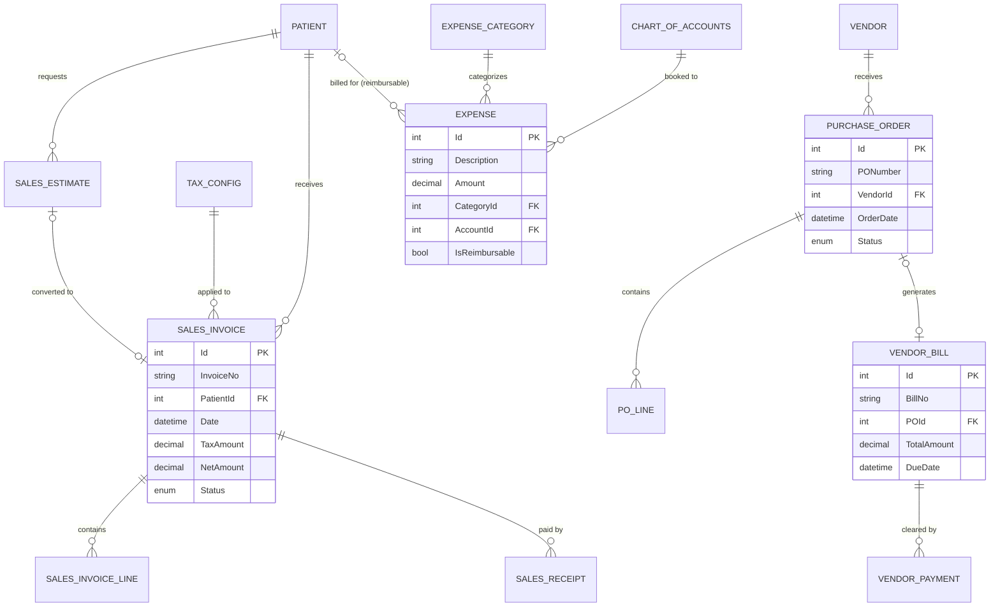

# Sales & Procurement Unified Module Plan

## 1. Executive Summary
This module bridges the gap between clinical operations and financial accounting. it ensures that every patient interaction, vendor purchase, and daily expense is captured, taxed correctly, and recorded in the General Ledger.

All financial objects (SalesInvoice, PurchaseOrder, VendorBill, Expense) reuse the schemas defined in the financial system plan; this document simply orchestrates how Clinic, Inventory, and Finance interact.

---

## 2. Operational Scenarios (How it Works)

### Scenario A: The Patient Quote (Sales Estimate)
1.  **Action**: A patient arrives at the reception asking for the price of a "Heart Surgery Package."
2.  **System Process**: The receptionist clicks **"Create Estimate"**, selects the services.
3.  **Outcome**: The system generates a `SalesEstimate`. This has **NO financial impact** yet (no journal entry). 
4.  **Conversion**: If the patient agrees, the receptionist clicks **"Convert to Invoice"**. The system then creates a `SalesInvoice` and triggers a Journal Entry (Debit: Accounts Receivable, Credit: Revenue).

### Scenario B: Procurement & Inventory Restock
1.  **Action**: The pharmacist notices Low Stock for "Paracetamol."
2.  **System Process**: They click **"Create PO"**, select the Vendor, and add 500 units.
3.  **Outcome**: A `PurchaseOrder` is sent to the vendor.
4.  **Receipt**: When the items arrive, the user clicks **"Receive Items"**. The system creates a `VendorBill` and updates the Inventory quantities.
5.  **Financials**: The system records a Journal Entry (Debit: Inventory Asset, Credit: Accounts Payable).

### Scenario C: Daily Clinic Expenses
1.  **Action**: The office manager buys cleaning supplies for 500 AFN.
2.  **System Process**: They click **"Record Daily Expense"**, select Category "Maintenance," and upload the receipt.
3.  **Outcome**: The system records the `Expense` and immediately generates a Journal Entry (Debit: Maintenance Expense, Credit: Cash/Bank).

---

## 3. Technical Implementation Details

### A. Database Schema (Entity Level)

#### Table: `SalesInvoice`
| Field Name | Type | Purpose |
| :--- | :--- | :--- |
| `InvoiceNo` | string | Unique identifier (e.g., INV-2026-0001). |
| `PatientId` | int (FK) | Link to the customer/patient. |
| `TaxAmount` | decimal | Calculated based on `TaxConfig`. |
| `Discount` | decimal | Amount subtracted from total. |
| `NetAmount` | decimal | Final payable amount. |
| `Status` | enum | Draft, Open, Paid, Void. |

#### Table: `PurchaseOrder`
| Field Name | Type | Purpose |
| :--- | :--- | :--- |
| `PONumber` | string | Unique identifier. |
| `VendorId` | int (FK) | Who we are buying from. |
| `ExpectedDate`| DateTime | For tracking delivery delays. |
| `Status` | enum | Pending, Received, Cancelled. |

---

### B. Service Layer Specifications

#### `ISalesService`
- **`ConvertEstimateToInvoiceAsync(int estimateId)`**
  - **Logic**: Copies all line items from the estimate to a new invoice and marks the estimate as "Closed."
- **`CalculateTaxAsync(decimal amount, int taxId)`**
  - **Logic**: Returns the tax value based on clinic settings (VAT, Service Tax, etc.).

#### `IPurchaseService`
- **`GenerateVendorBillFromPO(int poId)`**
  - **Logic**: Automatically populates bill amounts based on what was actually received in the warehouse.

### Integration Contracts & Events
- **`Sales.EstimateConverted`** → emitted once an estimate becomes an invoice; payload matches the financial module’s `SalesInvoice` schema.
- **`Sales.InvoicePaid`** → signals Accounts Receivable that cash hit the bank (used by FinancialBridge for postings).
- **`Procurement.POReceived`** → raised when warehouse receipt occurs, referencing Inventory `StockId` records and enabling AP accruals.
- **`Expense.Recorded`** → event with expense category, amount, and attachment metadata for financial audit trails.
- **`Tax.TableUpdated`** → shared cache invalidation event so Clinic/Inventory recalculations stay accurate.

---

### C. API Payload Definitions

#### `POST /api/Sales/Invoice/Create`
```json
{
  "patientId": 405,
  "date": "2026-01-20",
  "items": [
    { "serviceId": 12, "qty": 1, "price": 5000 },
    { "inventoryId": 88, "qty": 2, "price": 200 }
  ],
  "taxId": 1,
  "discountAmount": 100
}
```

#### Table: `ServicePackage`
*Purpose: A bundle of services sold as one unit.*
- `Id` (int PK)
- `PackageName` (string)
- `PackagePrice` (decimal)
- `IsActive` (bool)

#### Table: `ServicePackageLine`
- `Id` (int PK)
- `PackageId` (int FK)
- `ServiceId` (int FK)
- `Quantity` (int) -> Number of sessions included.

---

## 4. Sales & Procurement ERD



---

## 5. Integration Bridge
| Event | Financial Impact (Journal Entry) |
| :--- | :--- |
| **Invoice Issued** | Debit: Accounts Receivable | Credit: Sales Revenue |
| **Bill Entered** | Debit: Expense / Inventory | Credit: Accounts Payable |
| **Payment Received**| Debit: Cash/Bank | Credit: Accounts Receivable |
| **Payment Sent** | Debit: Accounts Payable | Credit: Cash/Bank |

---

## 5. Technical Roadmap
1. **Schema Update**: Create the tables for Invoices, POs, and Expenses.
2. **Sales Service**: Implement `ISalesService` for invoice generation and tax calculation.
3. **Purchase Service**: Implement `IPurchaseService` to handle PO-to-Bill workflows.
4. **Expense Service**: Implement `IExpenseService` for daily tracking and reimbursables.
5. **Financial Sync**: Connect all "Save" actions to the `JournalEntry` generator.

## UI/UX & Deployment Strategy
- Rebuild quote-to-invoice, PO, receiving, and expense forms where necessary; legacy pages can be replaced outright because we are launching fresh.
- Share tax, customer, vendor, and inventory selectors with Clinic and Inventory modules for a consistent experience.
- No migration work is needed—seed sample customers, vendors, and tax tables via automation.

## Testing Strategy
### Unit Tests
- Tax calculation, discount application, and multi-currency rounding
- PO receipt accrual logic and expense category validation
- Workflow guards (estimate conversion, PO status transitions)

### Integration & Contract Tests
- `Sales.EstimateConverted`, `Sales.InvoicePaid`, `Procurement.POReceived`, and `Expense.Recorded` contract suites
- Financial journal postings for invoices, receipts, bills, and expenses
- Inventory receipt synchronization to ensure quantities and costs match stock entries

### UI/UX Validation
- Cypress/Playwright journeys covering quote → invoice → payment and PO → bill → payment
- Accessibility/localization checks for sales/procurement forms
- User walkthroughs with reception, procurement, and finance staff to validate redesigned flows
